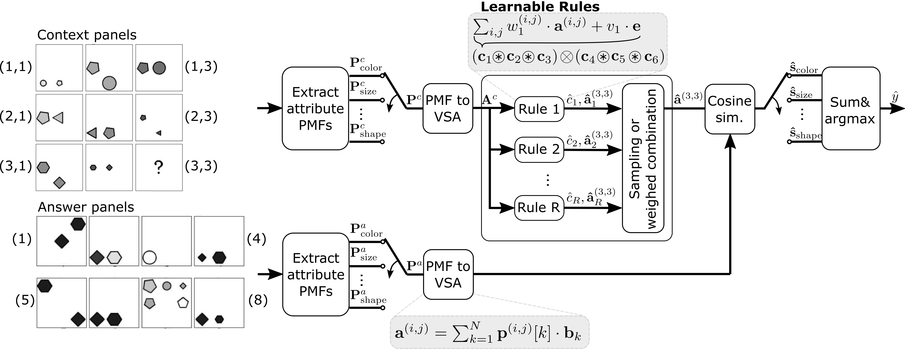

# Probabilistic Abduction for Visual Abstract Reasoning via Learning Rules in Vector-symbolic Architectures

### Michael Hersche, Francesco di Stefano, Thomas Hofmann, Abu Sebastian, Abbas Rahimi

_3rd MATH-AI Workshop at NeurIPS'23_

<div align="center">
  
</div>

<!-- ## [[Paper]](add link here) -->

## Requirements

### Hardware
You will need a machine with a CUDA-enabled GPU and the Nvidia SDK installed to compile the CUDA kernels. We tested our methods on an NVIDA Tesla V100 GPU with CUDA Version 11.3.1. 

### Installing Dependencies

The `conda` software is required for running the code. Generate a new environment with

```
$ conda create --name learnVRFenv python=3.7
$ conda activate learnVRFenv
```

We need PyTorch 1.11 and CUDA. 

```
$ (learnVRFenv) conda install pytorch==1.11.0 torchvision==0.12.0 cudatoolkit=11.3 -c pytorch -c conda-forge
$ (learnVRFenv) pip install -r requirements.txt
```

As a last requirement, you need to install the [neuro-vsa](https://github.ibm.com/her-zurich/neuro-vsa) by cloning the code and running

```
$ (learnVRFenv) pip install -e /path/to/neuro-vsa/ --no-dependencies
```

Make sure to activate the environment before running any code. 

### I-RAVEN Dataset

Generate the I-RAVEN dataset with the instructions proveded [here](https://github.com/husheng12345/SRAN). Save it under  `dataset/`.

## Prepare Data

Run the rule preprocessing script:
```
$ (learnVRFenv) python3 src/util/extraction.py --path dataset/
```

## Run Model
You can run the training and evaluation on the I-RAVEN dataset for all constellation by running one of the following scripts:  

```bash
(learnVRFenv) experiments/learn_VRF_id.sh
(learnVRFenv) experiments/learn_VRF_ood.sh
(learnVRFenv) experiments/MLP_id.sh
(learnVRFenv) experiments/MLP_ood.sh
```

## Citation

If you use the work released here for your research, please cite our paper:
```
@inproceedings{hersche2023learnVRF,
  title={Probabilistic Abduction for Visual Abstract Reasoning via Learning Rules in Vector-symbolic Architectures},
  author={Hersche, Michael and di Stefano, Francesco and Hofmann, Thomas and Sebastian, Abu and Rahimi, Abbas},
  journal={3rd Workshop on Math-AI (MATH-AI@ NeurIPS)},
  year={2023}
}
```


## License
Please refer to the LICENSE file for the licensing of our code. Our implementation relies on [PrAE](https://github.com/WellyZhang/PrAE) released under GPL v3.0